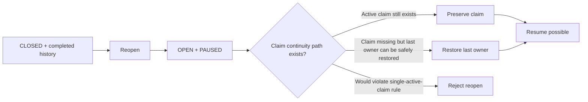

# Station Execution Workflow Diagrams
## Current implemented backend baseline

These diagrams describe the **current implemented execution-core baseline**, not the full future canonical target.

## 1. Core implemented flow

```mermaid
flowchart TD
    A[Queue / select operation] --> B[Claim operation]
    B --> C[Start execution]
    C --> D[IN_PROGRESS]

    D --> E[Report production delta]
    E --> D

    D --> F[Pause execution]
    F --> G[PAUSED]
    G --> H[Resume execution]
    H --> D

    D --> I[Start downtime]
    G --> I
    I --> J[BLOCKED + downtime_open]
    J --> K[End downtime]
    K --> L[PAUSED]

    D --> M[Complete execution]
    M --> N[COMPLETED + OPEN]

    N --> O[Close operation (SUP-only phase rule)]
    O --> P[CLOSED]

    P --> Q[Reopen operation (SUP-only phase rule + reason)]
    Q --> R[OPEN + PAUSED]
    R --> H
```

## 2. Reopen continuity note



## 3. Explicitly deferred flows
The following are **not implemented** in the current backend baseline and therefore remain outside these implementation-aligned diagrams:
- station session flow
- QC measurement and QC hold flow
- exception/disposition flow
- approved-effects unlock flow
- quality/review-gated close/reopen variants
