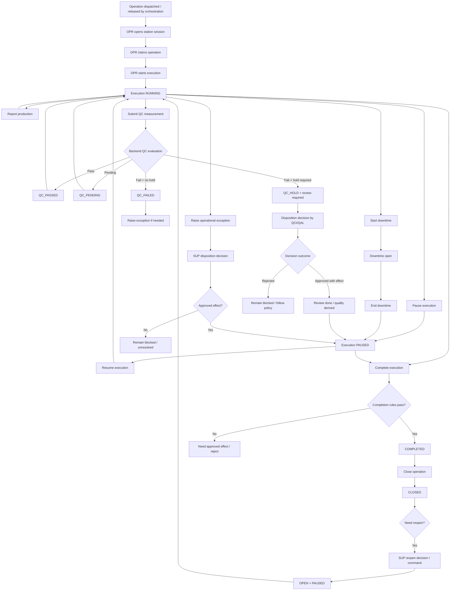
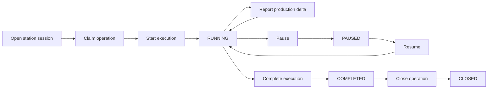
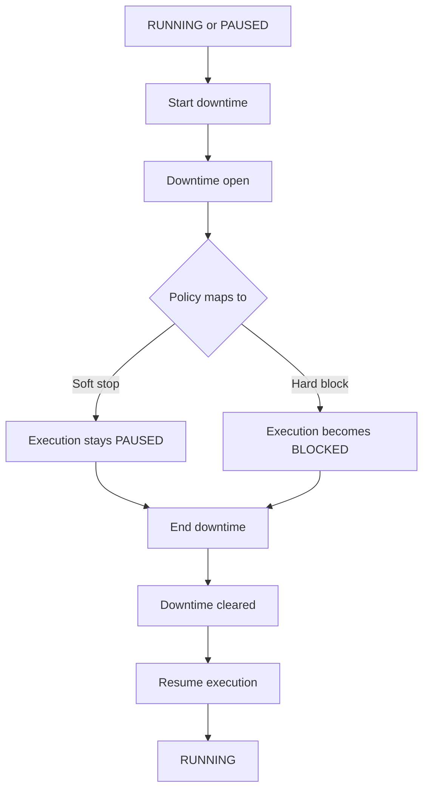
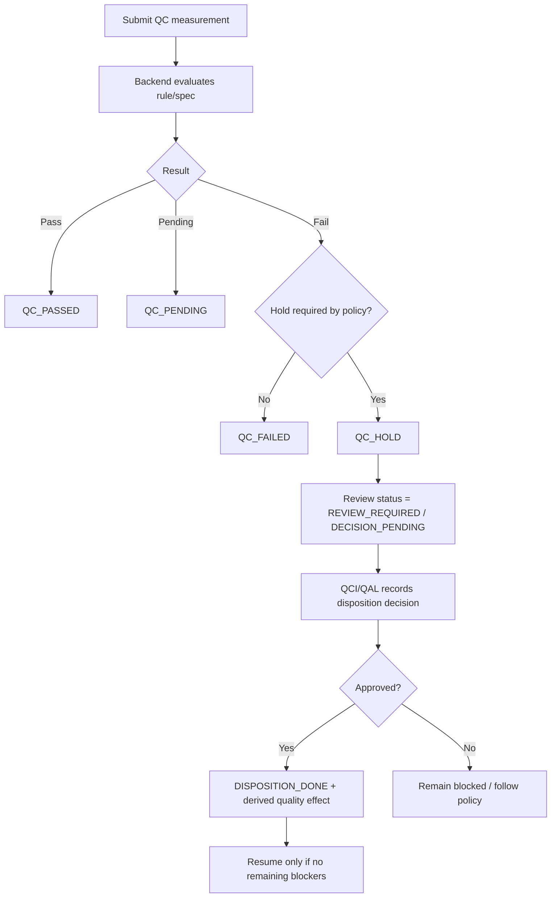
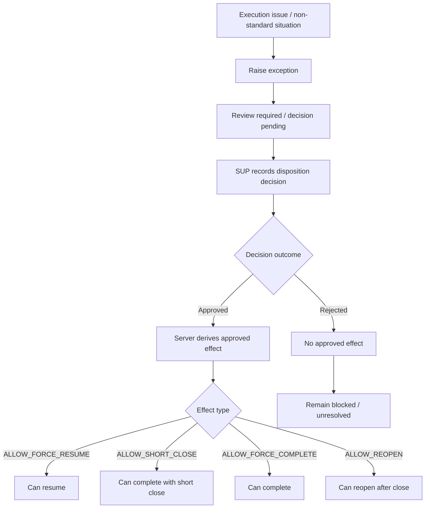
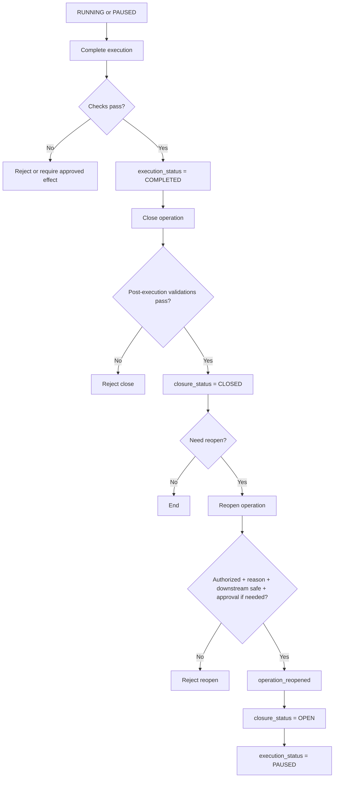
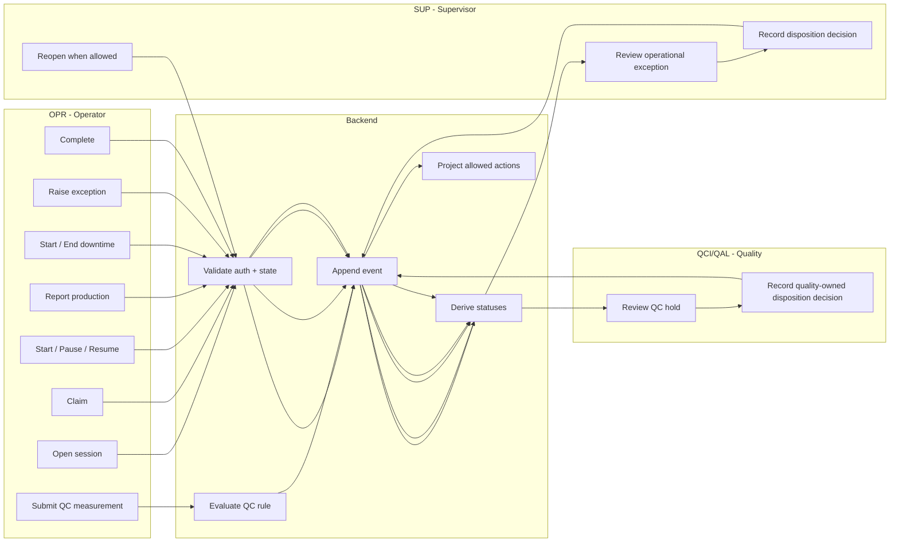

# Station Execution Workflow Diagrams

## 1. End-to-end overview

## 2. Core operator flow

## 3. Downtime path

## 4. QC and quality hold path

## 5. Operational exception path

## 6. Complete -> close -> reopen path

## 7. Responsibility swimlane view

