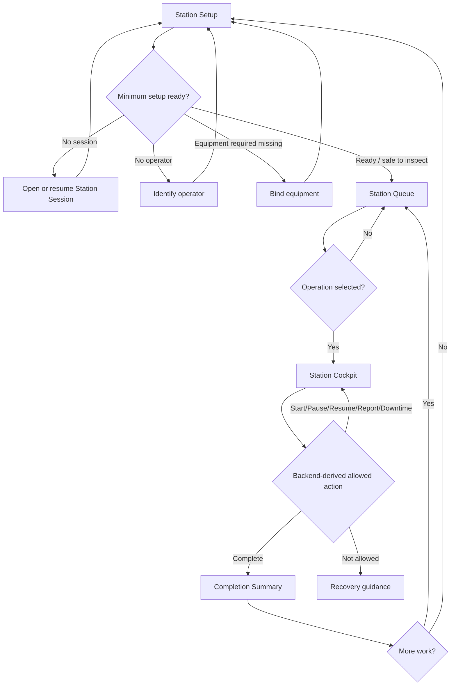
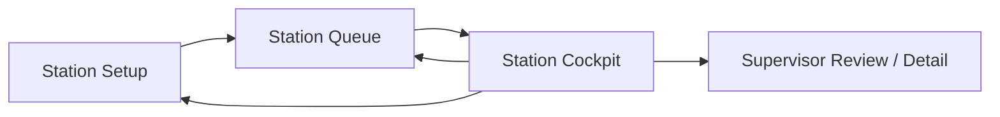

# Station Workflow Redesign Contract v1

## History
| Date | Version | Change |
|---|---:|---|
| 2026-05-10 | v1.0 | Initial workflow redesign contract for Station operator/supervisor journey, truth boundaries, and implementation slicing. |
| 2026-05-10 | v1.1 | Replaced consolidated stage-panel shell decision with three-screen operator flow: Station Setup -> Station Queue -> Station Cockpit. |

## Status
Draft for implementation slicing

## Scope
- Define the canonical Station operator journey using three screens:
  - Station Setup
  - Station Queue
  - Station Cockpit
- Preserve backend truth boundaries for session ownership and execution command legality.
- Define screen ownership boundaries, P0/P1 scope boundaries, and implementation slice sequencing.
- Keep supervisor support surfaces explicit and non-dominant in the operator flow.

## Non-Goals
- No frontend implementation in this contract slice.
- No backend/service/API contract changes.
- No route changes.
- No test implementation.
- No allowed_actions behavior changes.
- No execution command behavior changes.
- No P1 scan/qualification/eligibility implementation.

## Baseline Evidence
### Design and governance sources read
- docs/design/07_ui/station-workflow-redesign-contract-v1.md (previous state)
- docs/design/07_ui/station-execution-screen-pack-v4.md
- docs/design/07_ui/station-execution-component-map-v1.md
- docs/design/07_ui/station-execution-responsive-contract-v1.md
- docs/audit/station-responsive-qa-report.md
- docs/design/02_domain/execution/station-session-ownership-contract.md
- docs/design/02_domain/execution/station-session-command-guard-enforcement-contract.md
- docs/design/02_domain/execution/station-execution-state-matrix-v4.md
- docs/design/00_platform/product-business-truth-overview.md
- docs/governance/ENGINEERING_DECISIONS.md
- docs/governance/CODING_RULES.md

### Source evidence read (grounding only)
- frontend/src/app/pages/StationSession.tsx
- frontend/src/app/pages/OperatorIdentification.tsx
- frontend/src/app/pages/EquipmentBinding.tsx
- frontend/src/app/pages/StationExecution.tsx
- frontend/src/app/components/station-execution/StationWorkflowShell.tsx
- frontend/src/app/components/station-execution/StationEntryHandoff.tsx
- frontend/src/app/components/station-execution/CompletionSummaryPanel.tsx
- frontend/src/app/components/station-execution/AllowedActionZone.tsx
- frontend/src/app/components/station-execution/StationQueuePanel.tsx
- frontend/src/app/api/stationApi.ts
- frontend/src/app/api/operationApi.ts
- frontend/src/app/routes.tsx

## Core Decision
Replace prior decision:
- Consolidated Station Shell with stage panels

With new decision:
- Three-screen Station operator flow:
  1. Station Setup
  2. Station Queue
  3. Station Cockpit

This decision is a product/business-flow simplification and does not change backend command policy.

## Business Meaning
- Setup prepares context.
- Queue selects work.
- Cockpit executes work.
- Supervisor supports exceptions.
- Backend owns truth.
- Frontend guides and sends intent.

## Station Setup / Queue / Cockpit Definitions

### Station Setup
Purpose:
- Prepare execution context before queue selection/execution.

Contains:
- Station session open/resume/close intent surface.
- Operator identification confirmation.
- Equipment binding/context confirmation.
- End session/handoff guidance.

Minimum ready rule:
- Station selected
- plus session open
- plus operator identified
- plus equipment bound only if backend says equipment is required

Backend safety rule:
- Even when Setup allows entering Queue, backend still revalidates session/operator/equipment context on execution mutation commands.

### Station Queue
Purpose:
- Select work from backend-derived queue context.

Contains:
- Compact context header.
- Queue metrics and filters.
- Operation list/cards.
- Operation selection.

Explicitly excludes in P0:
- Full STX strip.
- Large setup checklist.
- Close session as primary action.
- Execution mutation commands.

Transition:
- select operation -> Station Cockpit

### Station Cockpit
Purpose:
- Execute selected operation with backend-derived command legality.

Contains:
- Selected operation context.
- Backend-derived allowed actions.
- Quantity reporting.
- Downtime controls/state.
- Completion visibility.
- Recovery/error guidance.
- Back to Queue affordance.

Explicitly excludes in P0:
- Full queue/filter panel.
- Setup checklist.
- Close Session primary button.
- Next work/support queue panel.

Queue access in Cockpit:
- Back to Queue remains required.
- Queue popup/dropdown may remain as secondary access.
- Compact next-work preview is optional future and not required in P0.

## Screen Ownership Matrix

| Screen | Owns | Does Not Own |
|---|---|---|
| Station Setup | station session, operator identification, equipment binding/context, end session/handoff | queue browsing, execution commands |
| Station Queue | queue metrics, filters, operation list/cards, operation selection | setup checklist, execution command actions |
| Station Cockpit | selected operation, backend-derived allowed actions, quantity, downtime, completion | full queue filters, full setup workflow |
| Supervisor Review | close/reopen/review/blocker support | operator primary execution |
| Operation Detail | read-only event/audit timeline | command execution |

## P0 vs P1 Scope Boundary

### P0
Operator identify:
- use current logged-in user
- confirm bind operator to Station Session
- manual fallback only if existing user list/API already supports it

Equipment binding:
- auto-bind default station equipment if configured
- basic manual select/bind only if existing equipment list supports it
- if equipment-required signal is unavailable, show Optional / not confirmed

### P1 (Deferred)
Operator:
- badge scan / QR scan
- employee code input
- supervisor override
- operator qualification/training
- cross-session operator conflict checks

Equipment:
- QR/RFID asset scan
- eligible equipment by station/operation resource requirements
- maintenance/down status constraints
- calibration/qualification constraints
- exclusive binding conflict handling

## Command Policy Awareness and Truth Boundary
- Session ownership and execution command legality are backend-owned.
- Frontend must not derive command legality from status text alone.
- Frontend sends intent and renders backend-derived outcomes/allowed actions.
- StationSession close remains backend-guarded; frontend must not decide close legality.
- Supervisor capabilities (close/reopen/review) remain backend policy and role-gated.

## Completion and End Session Contract
After complete:
- if more work exists -> Return to Queue
- if no obvious next work -> End Session / Handoff via Station Setup

Session close legality:
- always backend-guarded
- frontend provides recovery guidance only

## Supervisor Boundary
- close/reopen/review are supervisor support surfaces
- not primary operator CTAs
- supervisor support may be linked from Cockpit
- supervisor actions must not dominate operator execution flow

## Business Flow Diagram

## Screen Transition Diagram

## Mapping to Legacy STX Vocabulary (Compatibility Only)
- Station Setup: STX-001, STX-002, STX-003, STX-009
- Station Queue: STX-004
- Station Cockpit: STX-005, STX-006, STX-007
- Supervisor support: STX-008

Note:
- This mapping preserves continuity for existing docs and references.
- Product direction is now three-screen flow, not a full in-screen stage rail.

## Implementation Slicing Proposal
1. FE-STATION-THREE-SCREEN-SETUP-01
- Simplify Station Setup screen.
- Move session/operator/equipment/end-session concerns here.

2. FE-STATION-THREE-SCREEN-QUEUE-01
- Simplify Queue as work selection screen.
- Remove setup checklist and cockpit execution content from Queue surface.

3. FE-STATION-THREE-SCREEN-COCKPIT-01
- Simplify Cockpit as active operation screen.
- Remove full queue and setup UI.
- Keep Back to Queue only; queue popup/dropdown can remain as secondary if already safe.

4. FE-STATION-THREE-SCREEN-ROUTE-01
- Optional explicit routes only after UI modes are stable.
- No route expansion before mode boundaries are proven stable.

5. FE-STATION-P0-E2E-01
- P0 happy-path automation once the three-screen surfaces are stable.

6. STATION-P1-IDENTIFY-BIND-CONTRACT-01
- Badge/QR/RFID/qualification/eligibility contract after P0 stabilization.

## Open Questions
- Should Setup and Queue remain route-separated in P0, or be one route with internal mode split until FE-STATION-THREE-SCREEN-ROUTE-01?
- Should backend expose explicit equipment-required signal in current session payload to remove optional/unknown ambiguity?
- Should supervisor deep-links from Cockpit point to existing supervisory operation page only, or also operation detail timeline by role?

## Definition of Done (Contract Slice)
- Three-screen operator flow replaces consolidated stage-panel shell as explicit product direction.
- Screen ownership boundaries are unambiguous.
- P0/P1 boundaries are explicit and stable.
- Setup minimum ready rule is explicit and backend-guard consistent.
- Queue and Cockpit exclusions are explicit (including no cockpit next-work panel in P0).
- Completion and end-session behavior is explicit and backend-truth compliant.
- Supervisor boundary is explicit and non-dominant in operator flow.
